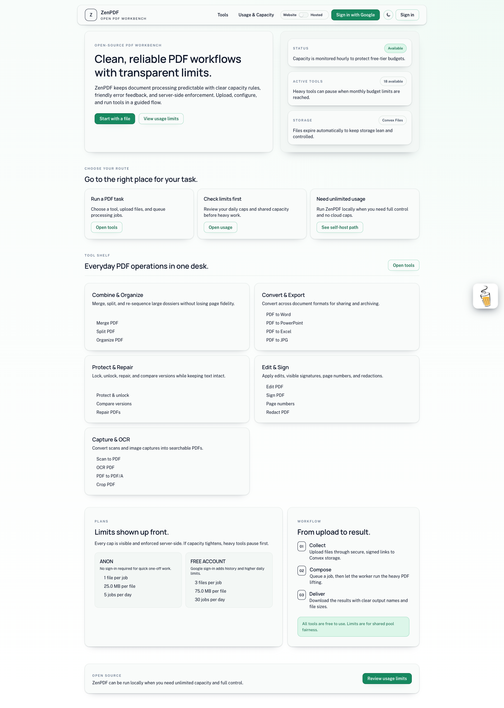

# ZenPDF

ZenPDF is a web app for running PDF operations with a background worker.

## Live app
- Primary: https://thezenpdf.vercel.app
- Alternate alias: https://zenpdf.vercel.app

## App preview



## Project stages
- Stage 1: Code is written.
- Stage 2: Run locally with a dev deployment (Convex + Clerk + local worker).
- Stage 3: Public/free domain (web + hosted Convex + cloud worker).

## Components
- Web (Next.js): UI and API routes.
- Convex: database + serverless functions (`npx convex dev` syncs to a free dev deployment).
- Worker (Python): polls for jobs, processes files, uploads outputs.
  - Runs on your local CPU/RAM/disk by default (no GPU unless you add it).

## Tool scope
- ZenPDF exposes a strict 27-tool catalog aligned to iLovePDF parity:
  - Merge PDF, Split PDF, Compress PDF
  - PDF to Word, PDF to PowerPoint, PDF to Excel
  - Word to PDF, PowerPoint to PDF, Excel to PDF
  - Edit PDF, PDF to JPG, JPG to PDF
  - Sign PDF, Watermark, Rotate PDF, HTML to PDF
  - Unlock PDF, Protect PDF, Organize PDF
  - PDF to PDF/A, Repair PDF, Page numbers
  - Scan to PDF, OCR PDF, Compare PDF, Redact PDF, Crop PDF

## Run locally (dev)
1) Configure environment
- `apps/web/.env.local` (see `apps/web/.env.example`)
  - Clerk keys + JWT issuer/audience
  - `ZENPDF_WORKER_TOKEN`
- `apps/worker/.env` (see `apps/worker/.env.example`)
  - `ZENPDF_CONVEX_URL`
  - `ZENPDF_WORKER_TOKEN`

2) Start Convex (terminal A)
```bash
cd apps/web
npx convex dev
```

3) Start the web app (terminal B)
```bash
cd apps/web
npm install
npm run dev
```

4) Start the worker (terminal C)
```bash
cd apps/worker
python -m pip install -r requirements.txt
python main.py
```

Open `http://localhost:3000`.

## Public/free domain (overview)
- Web: deploy to Vercel (free tier).
- Convex: use a production deployment (hosted by Convex).
- Worker: deploy to Cloud Run (free tier requires a billing account).

Note: Cloud Run free tiers are limited by vCPU/GiB time and requests. A continuously running worker can exceed free limits.

## Self-hosting
See `docs/SELF_HOST.md` for Docker Compose and local setup details.

## Hosted usage
If you are a casual user, use the hosted URL:
- https://thezenpdf.vercel.app
