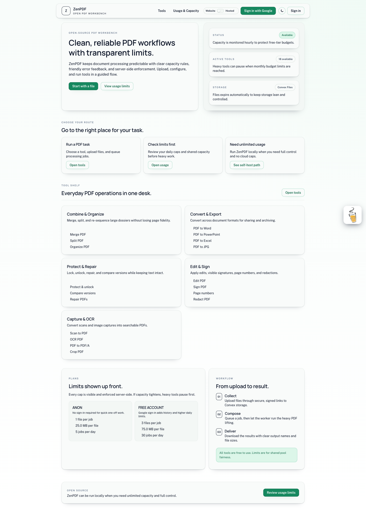

# ZenPDF

ZenPDF is an open-source PDF toolkit. The existing product is a Next.js web app with a Convex backend and Python worker; a private, local-first native desktop workspace for Omarchy Quattro is now being developed in the same repository.

## Live app
- https://thezenpdf.vercel.app

## Preview



The root `preview.png` is the original monochrome marketplace mark for the
native plugin listing.

## Tool scope (27)
- Merge PDF, Split PDF, Compress PDF
- PDF to Word, PDF to PowerPoint, PDF to Excel
- Word to PDF, PowerPoint to PDF, Excel to PDF
- Edit PDF, PDF to JPG, JPG to PDF
- Sign PDF, Watermark, Rotate PDF, HTML to PDF
- Unlock PDF, Protect PDF, Organize PDF
- PDF to PDF/A, Repair PDF, Page numbers
- Scan to PDF, OCR PDF, Compare PDF, Redact PDF, Crop PDF

## Repository layout
- `apps/web`: Next.js app (UI, API routes, Convex client)
- `apps/worker`: background worker for PDF processing
- `apps/desktop`: native Omarchy/Arch desktop app (planned and under active development)
- `docs`: product, architecture, feature internals, and operations

The root `manifest.json` and `Plugin.qml` provide the Omarchy Quattro plugin contract and launch the installed native `zenpdf` binary.

## Omarchy plugin

The plugin is a thin local launcher. Build the native Arch package as your
normal user from the immutable reviewed revision below, then install it and
add the plugin:

```sh
zenpdf_revision=97122a2564887b5c70b15ca69c9627adf7dd919a
work_root=$(mktemp -d)
git clone --filter=blob:none --no-checkout \
  https://github.com/rohan-patnaik/ZenPDF.git "$work_root/repo"
cd "$work_root/repo"
git fetch --depth=1 origin "$zenpdf_revision"
git checkout --detach "$zenpdf_revision"
test "$(git rev-parse HEAD)" = "$zenpdf_revision"

mkdir "$work_root/source"
git archive --format=tar --prefix=ZenPDF/ "$zenpdf_revision" \
  | tar -xf - -C "$work_root/source"
printf '%s\n' "$zenpdf_revision" \
  >"$work_root/source/ZenPDF/.zenpdf-source-revision"
source_archive="$work_root/repo/apps/desktop/packaging/arch/zenpdf-source-$zenpdf_revision.tar.gz"
tar -C "$work_root/source" -czf "$source_archive" ZenPDF

cd apps/desktop/packaging/arch
package_path=$(ZENPDF_SOURCE_ARCHIVE="$source_archive" \
  ZENPDF_EXPECTED_REVISION="$zenpdf_revision" makepkg --packagelist)
ZENPDF_SOURCE_ARCHIVE="$source_archive" \
ZENPDF_EXPECTED_REVISION="$zenpdf_revision" \
  makepkg --cleanbuild --clean --noconfirm
sudo pacman -U "$package_path"
omarchy plugin add https://github.com/rohan-patnaik/ZenPDF.git --enable --yes
omarchy-shell shell summon io.github.rohan-patnaik.zenpdf '{}'
```

The exact revision is also embedded in the package version and source marker.
The `PKGBUILD` refuses a moving Git branch or an archive without a matching
40-character revision. The native application depends on Qt 6 and qpdf; the
package resolves the complete Arch dependency set. ZenPDF processes only
user-selected local files in this desktop workflow.

Remove the plugin and native package with:

```sh
omarchy plugin remove io.github.rohan-patnaik.zenpdf
sudo pacman -Rns zenpdf-git
```

## Quick start (local)
1. Copy environment files:
   - `apps/web/.env.example` -> `apps/web/.env.local`
   - `apps/worker/.env.example` -> `apps/worker/.env`
2. Ensure `ZENPDF_WORKER_TOKEN` matches in both env files.
3. Start Convex (terminal 1, long-running):
   - `cd apps/web && npx convex dev`
4. Start web app (terminal 2, long-running):
   - `cd apps/web && npm install && npm run dev`
5. Start worker (terminal 3, long-running):
   - `cd apps/worker && python -m pip install -r requirements.txt && python main.py`
6. Open `http://localhost:3000`.

## Desktop build

ZenPDF Desktop is built independently, so the existing web and worker products keep their current toolchains. With Qt 6 Base, Qt 6 PDF, qpdf, CMake 3.25+, Ninja, and a C++23 compiler installed:

```sh
cmake -S apps/desktop -B build/desktop -G Ninja -DCMAKE_BUILD_TYPE=Debug
cmake --build build/desktop
ctest --test-dir build/desktop --output-on-failure
```

See `apps/desktop/README.md` for local-data and packaging details. Desktop progress is tracked without parity claims in `docs/ACROBAT_PARITY.md`.
Alpha scope, exact feature-branch package installation, and known limits are documented in `docs/ALPHA.md`.

## Core docs
- Product scope: `docs/PRD.md`
- System design: `docs/ARCHITECTURE.md`
- Per-feature internal logic: `docs/FEATURE_LOGIC.md`
- Security, deploy, monitoring, self-host ops: `docs/OPERATIONS.md`
- Contributor workflow: `CONTRIBUTING.md`
- Desktop capability matrix: `docs/ACROBAT_PARITY.md`
- Desktop security and recovery model: `docs/DESKTOP_SECURITY.md`

## License
- ZenPDF is licensed under the GNU Affero General Public License v3.0 (`AGPL-3.0`).
- See `LICENSE` for full terms.

## Attribution
- Copyright (c) 2026 Rohan Patnaik.
- Forks and redistributions must preserve copyright and license notices.
- Hosted modified versions must provide corresponding source code to users under AGPL.
- See `NOTICE` for attribution details.
